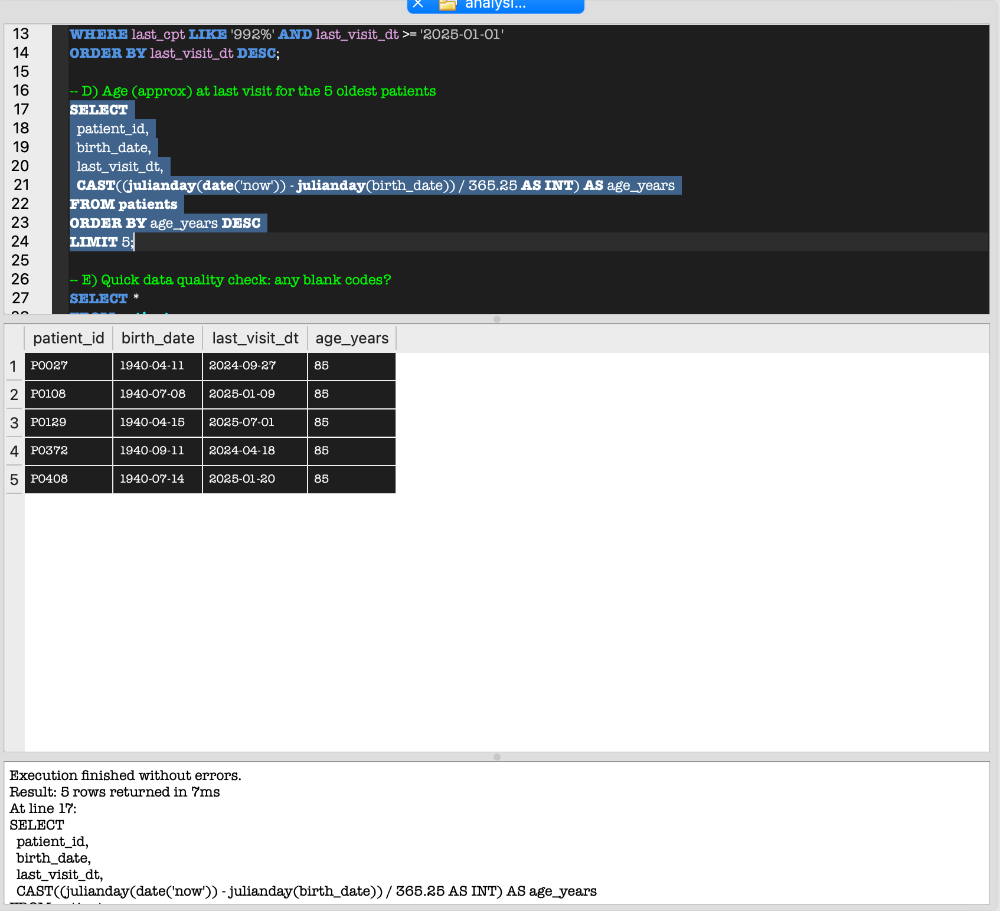

## Overview of the Project
The purpose of this assignment is to be able to read patients.csv with python/SQLite so that we can run and analyze queries through DBBrowser
## Steps to recreate the database
1. Recreate repository with appropriate python script files and make sure that Python, Pandas, SQLAlchemy are installed and install dependencies via requirements.txt.
2. Place patients.csv in data folder
3. Run src/create_db.py to create database
4. Run src/import_csv.py to load to CSV
5. Open clinic_simple.db in DB Browser for SQLite and run sql/analysis.sql queries

## Query results
### A

### B

### C

### D

### E

